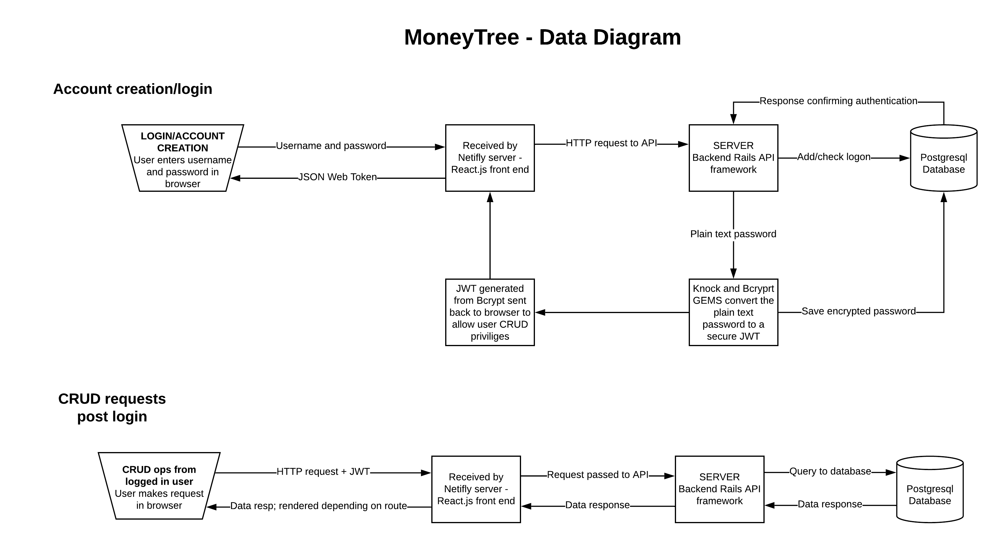
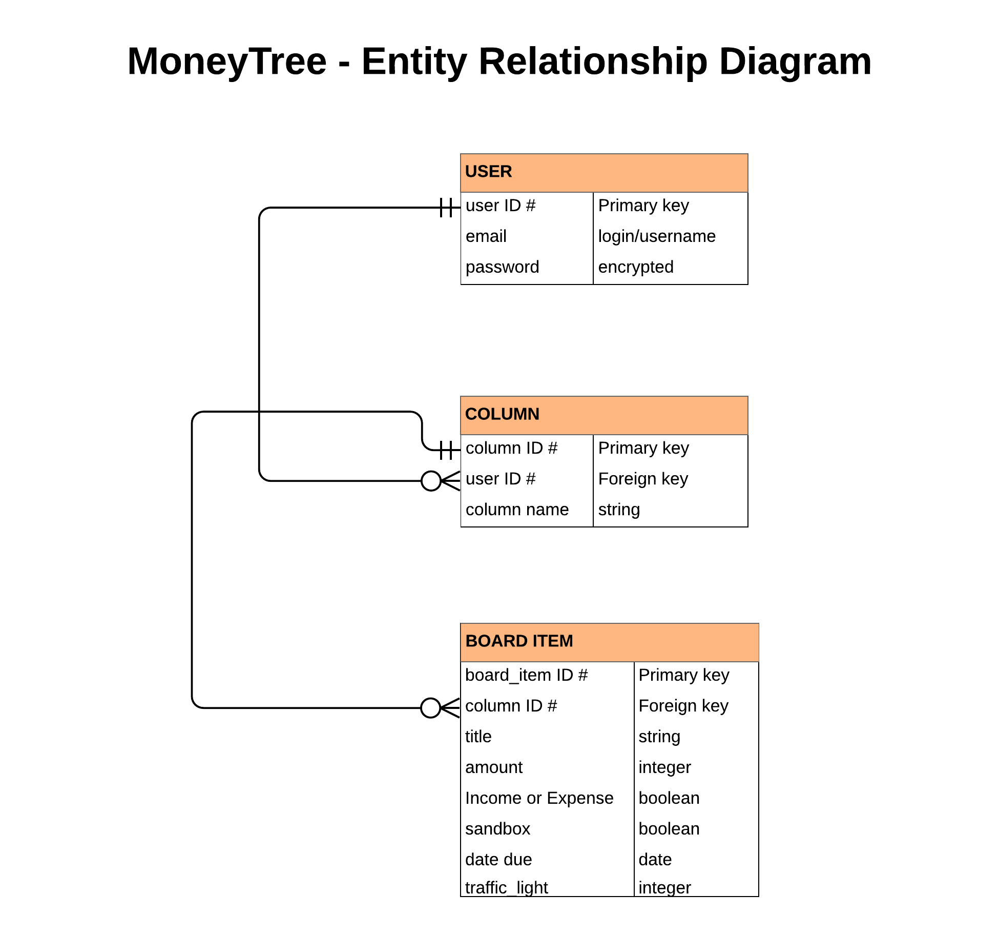
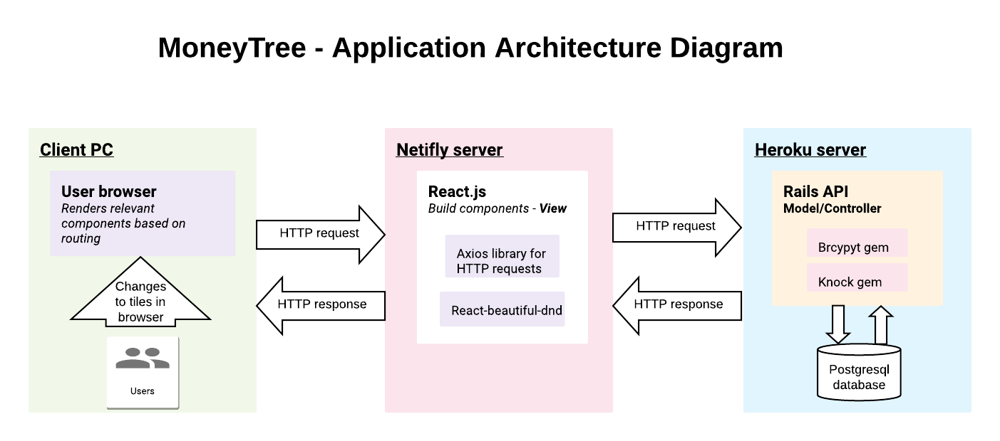
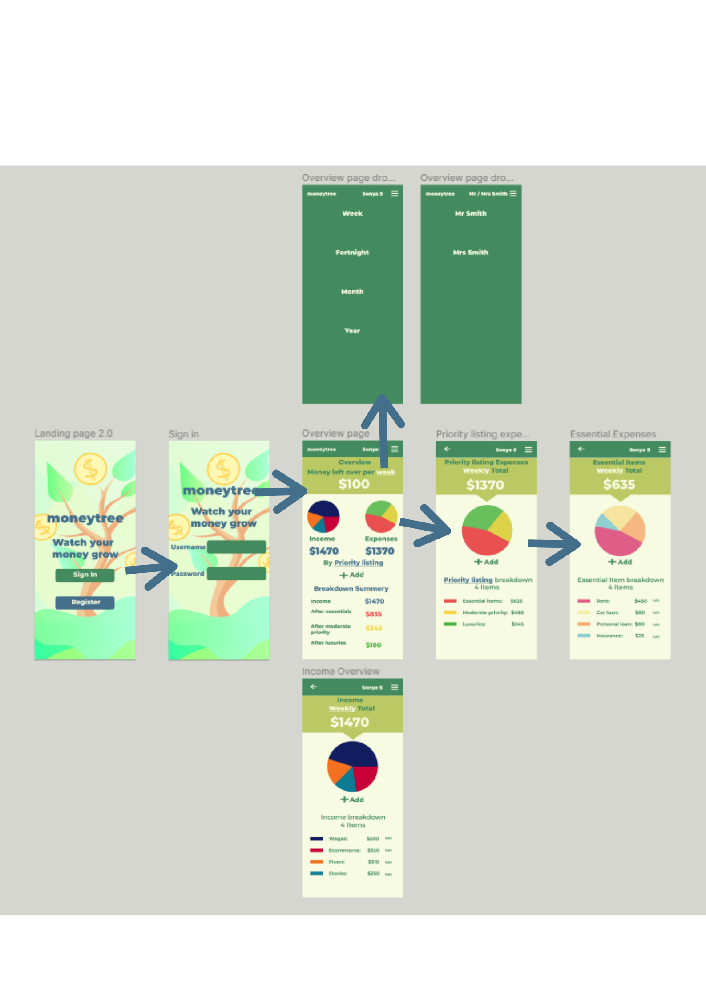
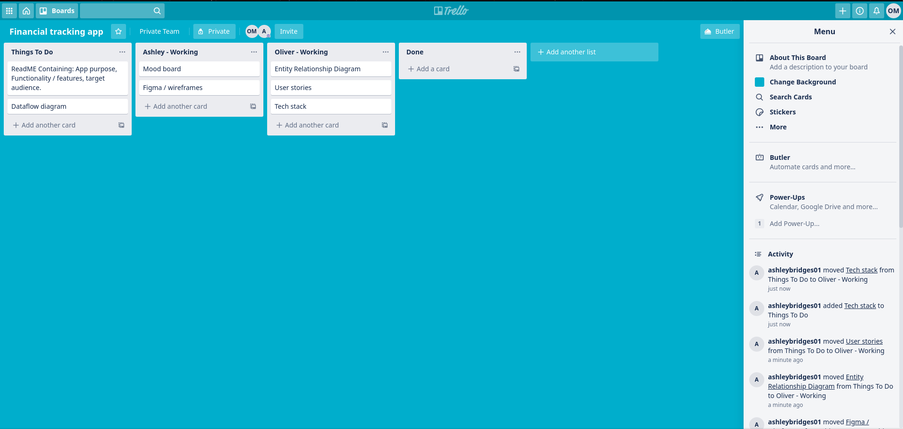
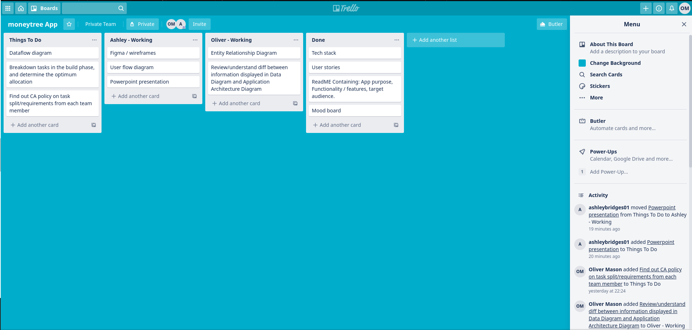
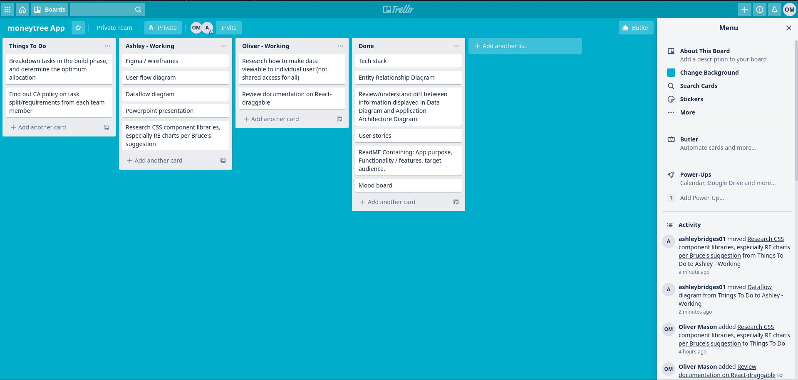
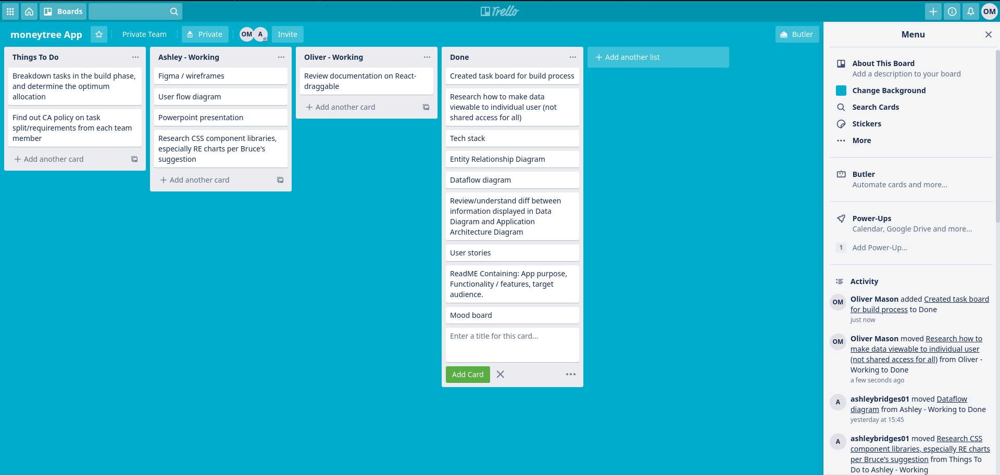
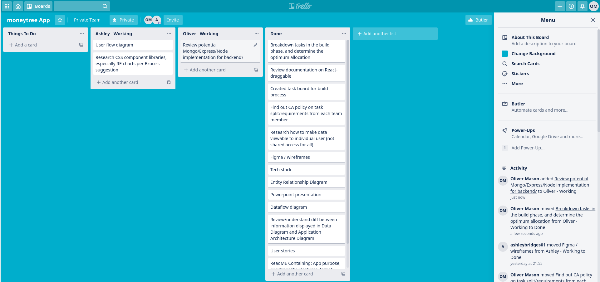

### R1 Description of MoneyTree

[Link to frontend live site](https://clever-lamport-79de35.netlify.app/)

[Link to backend live site](https://young-garden-83966.herokuapp.com/)

[Link to frontend github repo](https://github.com/ashleybridges01/moneytree)

[Link to backend github repo](https://github.com/olivervmason/rails_api_moneytree)

#### Purpose

The main concept of MoneyTree is for each user to be able to create a Trello style board in a matrix format. However, rather than having "to do" notes on the board tiles, they will have dollar values (and potentially dates) to reflect expected income and costs. 

The information collected and displayed on the tiles will be consolidated and presented to the user on an automatically customised dashboard to provide a usable decision making tool. The customisation will be driven by the way the tiles are organized on the screen: 

The first way the data is grouped will be represented vertically, as a traffic light system:

- Red colour tiles for items that absolutely must be paid
- Amber colour tiles for items that should be paid but are not critical
- Green colour tiles for items that might be considered a luxury, or are not time critical. 

In addition, the user can create as many columns as desired to group income or expenses by type (e.g. household costs or motoring costs, or costs paid by different partners in a relationship).

#### Functionality / features

Once logged in, a user will be able to create their own private, customised board. They first create the columns, and then the tiles underneath each column heading. 

The functionality which will transform the app from a regular calculator in to a usable tool is the ability to drag and drop tiles between columns and between traffic light categories. The real time update to the summary dashboard will make scenario modelling easy.

#### Target audience

Four target user types have been identified in the user stories under R4. For completeness, these user types are:

- A single mother
- A newly employed school graduate
- A "typical" family with two incomes and two children
- A small business owner

The main characteristic they have in common is having a need to make smart choices when it comes to spending their money (both what, and when). 

They have either a limited time or inclination to use traditional pen and paper planning methods (which are slow), or more sophisticated online tools (which take a long time to learn and set up). 

#### Tech stack

The back end of MoneyTree will be built using Ruby on Rails, set up in API mode. This will be integrated with a Postgresql database and hosted on Heroku. Two Ruby gems will be incorporated to permit secure user logon: knock (to generate the Javascript Web Token for user authentication), and bcrypt (to provide the password hashing algorithm).   

The site will be free, so no payment gems (e.g. Stripe) are needed.

The front end will utilise React.js, and be hosted on Netifly. It will communicate with the Rails API using the Axios http client. The useState, useEffect, and useContext hooks will be utilized where appropriate.

The "react-beautiful-dnd" addon component will be used to enable drag and drop functionality.

Testing will be performed using cypress.js.

### R2 Dataflow Diagram

All data is initially input by the user in their browser. Upon hitting submit, the information is passed via the front end Netifly server to the Rails API.

When creating an account, their plain text password will be converted in to a secure hash by Bcrypt, before being stored in the postgres database. At the same time a JSON Web Token will be returned to the user browser via the API, logging the user in.

All future requests (whether view a page, or to create/edit/delete data) will require this JWT received back from the API to authenticate them. 

All data will flow over and back over the same basic route (browser/front end/back end/database). As the user creates and edits board components in their browser, they are updating the values of the data held on the database - outlined below: 

The database structure required for the app to function is very simple as not much information is being held.

- The User entity exists to be able to create a user login profile which will be tied to their personalised and secure data.
- A Column entity exists to create the vertical column categories displayed on the webpage. These in turn hold the main board tiles (which at times may be empty placeholders). A user can have many columns but every column can only have one user.
- The board tiles within the column entity only need basic  information to be able to perform useful analysis: a description, the dollar amount, date due, whether it is an income or expense, and the traffic light priority. A column can have zero or many tiles, and each tile belongs to only one column. 

### R3 Application Architecture Diagram

### R4 User Stories

#### User Expectations

All users will expect the following features or functionality:

- To be provided with clear plain english instructions on how to use the app (i.e. examples with screenshots).
- To have a user friendly dashboard, displaying all the information they need to know.
- To be able to quickly and easily create, move, update, or delete items on the board.
- To be able to customise the board layout, especially with regard to the column headings.
- Potentially to be able to create a board from a pre-planned template.
- To be able to re-purpose the app for different needs (e.g. cash flow planning, budgeting).
- For their data to be stored so they can retrieve it at a later date.

#### User Characterisitics

Four distinct target user types were considered: 

- **Sonya the single mum**. Sonya works full time and has two young children, which leaves her very short on time. She cannot earn enough to comfortably provide for her family and often has to make tough choices on what she needs the least (i.e. sacrifices/tradeoffs).

    In her case, the goal of the app is to be able to allow quick and intuitive "what if" scenario planning. At any point if she knows what she has in the bank, she can quickly create and move items around the board to arrive at a result where she knows how much is left after the red category absolutely essential items are included,and can work out the best combination of other items on which to spend any remainder.   
   
- **Max the millenial**. After getting his first job and finding himself with a disposable income for the first time, Max wants to create a budget to be able to save up for the deposit on his first car. 
  
    Max wants to be able to calculate how much he will save each week or month based on his spending choices. After buying the car, he will want to review the budget to include the repayment amounts, petrol, and other running costs to know how much he can spend on upgrades or customisations.

- **A family with 2.4 children**. This user group represents a typical family which has two working parents and two or three children. They do not have to worry about paying the bills, but nor do they have so much money to spare that they have the luxury of a lassiez faire attitude.

    Both parents are earning, but have to spend a large proportion of the income on joint expenses. Although they create a joint account for this purpose, it is not clear how fair the current situation is to each of them. The parents want to be able to work out both how much each of them contributes, and how much disposable income each of them is theoretically left with.

- **Pete the plumber**. Pete is the owner of a small plumbing business. The business is well established and profitable but Pete struggles to juggle the timing of the many cash flows and make sure that there is always money in the bank when it is needed.

    Pete wants to be able to do scenario planning to enable him to plan for what is left after paying his employees. Costs such as inventory and advertising are variable and he also needs to put money aside for his tax bill. Added to this, customers do not always pay on time so he needs to plan accordingly.
    
    Pete needs to know when there will be money leftover to pay himself, and when he needs to put money back in to the business.

### R5 Wireframes for multiple standard screen sizes, created using industry standard software	

Detailed wireframes have been prepared and saved in pdf format in the resources file:

<a href="Resources/moneytree_wireframes.pdf">Wireframes pdf link</a>

These wireframes have also been used to illustrate the user flow around the mobile version of the site as shown below:

The following mood board was used to inspire the design process 

The main desktop view is shown below and includes the drag/drop feature.

### R6 Screenshots of your Trello board demonstrating use throughout the initial stages of the project	

Day 1 AM:

Day 2 AM:

Day 2 PM:

Day 3 AM:

Day 4 AM:

Day 4 PM:
Assessment submitted